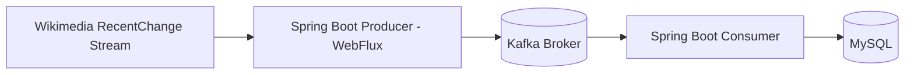
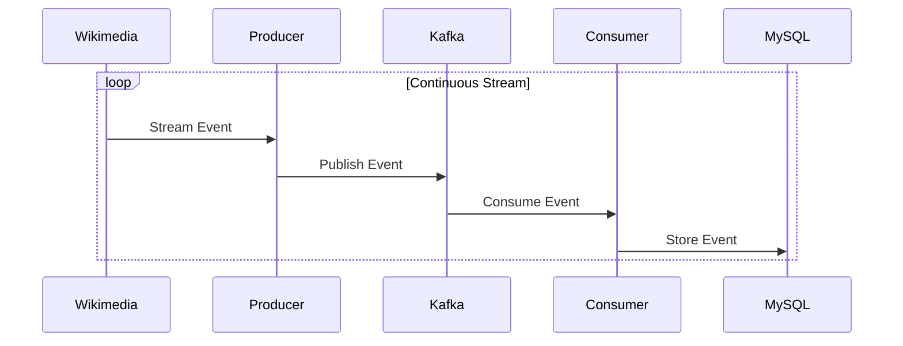
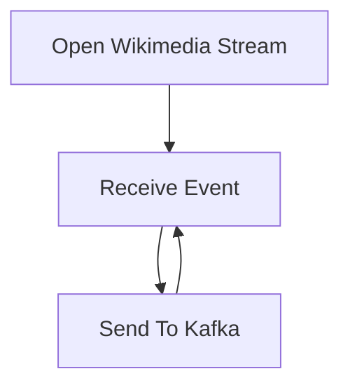
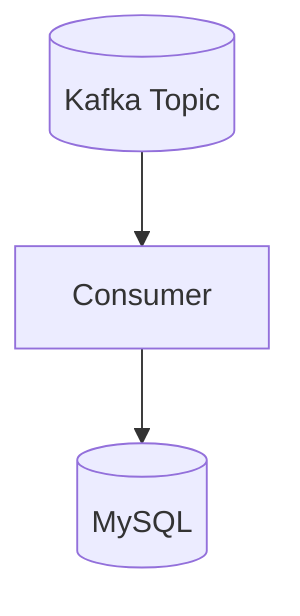
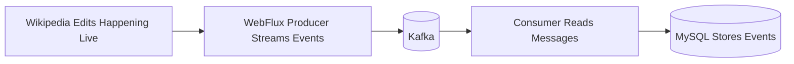

# Wikimedia Kafka Streaming Pipeline

A simple real-time streaming pipeline built with Spring Boot, Apache Kafka, WebFlux, and MySQL.

The producer streams live Wikimedia RecentChange events using Spring WebFlux and pushes them into Kafka.

The consumer reads those messages from Kafka and stores them into MySQL.

---

# Flow



---

# Streaming Flow



---

# Producer

The producer uses Spring WebFlux to continuously stream Wikimedia RecentChange events.



---

# Consumer

The consumer continuously reads messages from Kafka and stores them into MySQL.



---

# Running Kafka Broker (No Zookeeper)

Using the latest Kafka KRaft mode image.

## Run Kafka Container

```bash
docker run -d \
  --name kafka \
  -p 9092:9092 \
  apache/kafka:latest
```

---

# Connect Into Kafka Container

```bash
docker exec -it kafka bash
```

---

# Kafka Commands

## Show Topics

```bash
/opt/kafka/bin/kafka-topics.sh \
  --bootstrap-server localhost:9092 \
  --list
```

---

## Consume Messages From Beginning

```bash
/opt/kafka/bin/kafka-console-consumer.sh \
  --bootstrap-server localhost:9092 \
  --topic <topic> \
  --from-beginning
```

---

## Consume Only New Messages

```bash
/opt/kafka/bin/kafka-console-consumer.sh \
  --bootstrap-server localhost:9092 \
  --topic <topic>
```

---

# Running Applications

## Start Producer

```bash
./gradlew bootRun
```

Run this inside the producer project.

---

## Start Consumer

```bash
./gradlew bootRun
```

Run this inside the consumer project.

---

# End-to-End Pipeline



---
